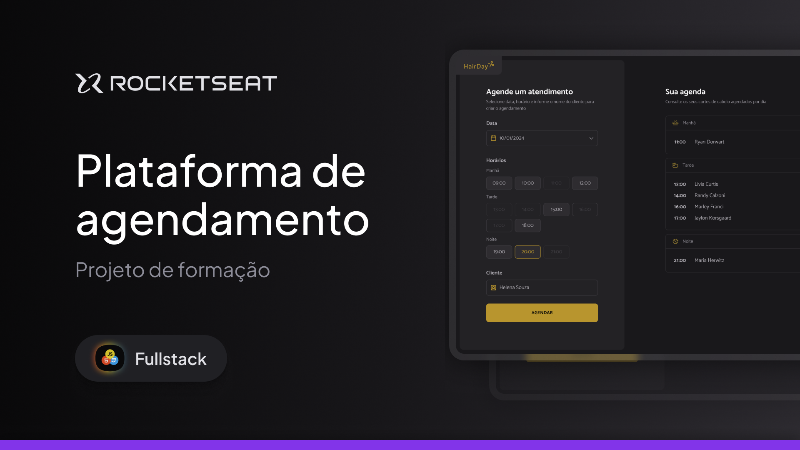

# 💇‍♀️ HairDay — Plataforma de Agendamento

  <a href="#-tecnologias">Tecnologias</a>&nbsp;&nbsp;|&nbsp;&nbsp;
  <a href="#-projeto">Projeto</a>&nbsp;&nbsp;|&nbsp;&nbsp;
  <a href="#-funcionamento">Funcionamento</a>&nbsp;&nbsp;|&nbsp;&nbsp;
  <a href="#-layout">Layout</a>&nbsp;&nbsp;|&nbsp;&nbsp;
  <a href="#memo-licença">Licença</a>

  

 

  

---

## 🚀 Tecnologias

Esse projeto foi desenvolvido com:

- HTML  
- CSS  
- JavaScript (ES Modules)  
- **Day.js**  
- **Webpack** (build e dev server)  
- **JSON Server** (API fake local)  
- Git e Github  
- Figma  

---

## 💻 Projeto

O **HairDay** é um sistema de agendamento para um salão de beleza.

A aplicação permite:

- Selecionar uma data  
- Ver horários disponíveis  
- Ver horários ocupados  
- Criar novos agendamentos  
- Cancelar agendamentos existentes  
- Listar agendamentos por período do dia  
- Atualizar automaticamente horários e listagens após qualquer ação  

Tudo isso com JSON Server funcionando como uma API REST local.

---

## ⚙️ Funcionamento do Sistema

### 🔹 1. Carregamento inicial
- A data é preenchida com a data atual.  
- São carregados os agendamentos do dia via GET.  
- São exibidos os horários disponíveis, ocupados e horários passados.

### 🔹 2. Seleção de horário
- Apenas `.hour-available` pode ser clicado.  
- Apenas um horário pode ser selecionado por vez.  
- O horário selecionado recebe `.hour-selected`.

### 🔹 3. Criar agendamento
Ao enviar o formulário:

- Nome do cliente é validado.  
- Horário selecionado é obrigatório.  
- O horário final é montado com Day.js.  
- O agendamento é salvo via:

- O sistema recarrega horários + lista de agendamentos.

### 🔹 4. Cancelar agendamento

Ao clicar no ícone de cancelar (lixeira):

Após o cancelamento, a UI é recarregada.

### 🔹 5. Períodos do dia

Os horários são organizados automaticamente:

- **Manhã → 09h às 12h**  
- **Tarde → 13h às 18h**  
- **Noite → 19h às 21h**

Os headers "Manhã", "Tarde", "Noite" são gerados dinamicamente.

---

🔖 Layout

O layout está disponível no Figma:

🔗 https://www.figma.com/design/vzpzerntsNuPIruAnluWRG/Plataforma-de-agendamento--Community-?node-id=928-587&m=dev

É necessário ter conta no Figma.

📝 Licença

Esse projeto está sob a licença MIT.